# Azure DevOps Architecture Diagram

This diagram shows how all components created by the Terraform configuration relate to each other in Azure DevOps.

```mermaid
graph TB
    subgraph "Azure DevOps Organization: cptdx"
        subgraph "Project: storagetest"
            
            subgraph "Source Control"
                REPO_MAIN[("📦 Repository<br/>storage-d1<br/><br/>Contains:<br/>- Terraform code<br/>- .pipelines/ci.yaml<br/>- .pipelines/cd.yaml")]
                REPO_TMPL[("📦 Repository<br/>storage-d1-templates<br/><br/>Contains:<br/>- Pipeline templates<br/>- Security isolated")]
                
                REPO_MAIN -.->|references| REPO_TMPL
            end
            
            subgraph "Branch Policies"
                BP_MERGE["🛡️ Merge Policy<br/>Squash only"]
                BP_BUILD["🛡️ Build Validation<br/>CI must pass"]
                BP_REVIEW["🛡️ Code Review<br/>(if 2+ approvers)"]
                
                REPO_MAIN --> BP_MERGE
                REPO_MAIN --> BP_BUILD
                REPO_MAIN --> BP_REVIEW
                REPO_TMPL --> BP_MERGE
            end
            
            subgraph "Pipelines"
                PIPE_CI["🔄 CI Pipeline<br/>01 Simple Storage VM<br/>Continuous Integration<br/><br/>Triggers:<br/>- PR to main<br/>- Commit to main"]
                PIPE_CD["🚀 CD Pipeline<br/>02 Simple Storage VM<br/>Continuous Delivery<br/><br/>Stages:<br/>1. Plan<br/>2. Apply"]
                
                PIPE_CI -->|reads from| REPO_MAIN
                PIPE_CD -->|reads from| REPO_MAIN
                PIPE_CI -.->|uses templates| REPO_TMPL
                PIPE_CD -.->|uses templates| REPO_TMPL
            end
            
            subgraph "Environments"
                ENV_PLAN["🎯 Environment<br/>storage-d1-plan<br/><br/>Purpose:<br/>Validation & Planning"]
                ENV_APPLY["🎯 Environment<br/>storage-d1-apply<br/><br/>Purpose:<br/>Deployment<br/>(can have approvals)"]
            end
            
            subgraph "Service Connections"
                SC_PLAN["🔐 Service Connection<br/>sc-storage-d1-plan<br/><br/>Auth: OIDC<br/>Role: Reader<br/>Managed Identity Client ID"]
                SC_APPLY["🔐 Service Connection<br/>sc-storage-d1-apply<br/><br/>Auth: OIDC<br/>Role: Contributor<br/>Managed Identity Client ID"]
                
                subgraph "Security Checks on Service Connections"
                    CHK_LOCK_PLAN["🔒 Exclusive Lock<br/>(prevents concurrent use)"]
                    CHK_LOCK_APPLY["🔒 Exclusive Lock<br/>(prevents concurrent use)"]
                    CHK_TMPL_PLAN["📋 Required Templates<br/>- ci-template.yaml<br/>- cd-template.yaml"]
                    CHK_TMPL_APPLY["📋 Required Templates<br/>- cd-template.yaml"]
                    CHK_APPROVAL["✅ Approval Check<br/>(if approvers configured)"]
                    
                    SC_PLAN --> CHK_LOCK_PLAN
                    SC_PLAN --> CHK_TMPL_PLAN
                    SC_APPLY --> CHK_LOCK_APPLY
                    SC_APPLY --> CHK_TMPL_APPLY
                    SC_APPLY -.->|optional| CHK_APPROVAL
                end
            end
            
            subgraph "Agent Infrastructure"
                POOL["🖥️ Agent Pool<br/>storage-d1<br/><br/>Type: Self-hosted<br/>Auto-update: true"]
                QUEUE["📋 Agent Queue<br/>(project-scoped)"]
                
                POOL --> QUEUE
            end
            
            subgraph "Configuration"
                VARGROUP["📊 Variable Group<br/>storage-d1<br/><br/>Variables:<br/>- BACKEND_AZURE_RESOURCE_GROUP_NAME<br/>- BACKEND_AZURE_STORAGE_ACCOUNT_NAME<br/>- BACKEND_AZURE_STORAGE_ACCOUNT_CONTAINER_NAME"]
            end
            
            subgraph "Security Groups"
                GROUP_APPROVERS["👥 Security Group<br/>storage-d1-approvers<br/><br/>Members: (none currently)<br/>Purpose: Approve deployments"]
            end
            
            %% Pipeline to Environment relationships
            PIPE_CI -->|uses| ENV_PLAN
            PIPE_CD -->|uses| ENV_PLAN
            PIPE_CD -->|uses| ENV_APPLY
            
            %% Pipeline to Service Connection relationships
            PIPE_CI -->|authenticates via| SC_PLAN
            PIPE_CD -->|stage 1: authenticates via| SC_PLAN
            PIPE_CD -->|stage 2: authenticates via| SC_APPLY
            
            %% Pipeline to Agent Pool relationships
            PIPE_CI -->|runs on| QUEUE
            PIPE_CD -->|runs on| QUEUE
            
            %% Pipeline to Variable Group relationships
            PIPE_CI -->|reads backend config| VARGROUP
            PIPE_CD -->|reads backend config| VARGROUP
            
            %% Approval relationships
            GROUP_APPROVERS -.->|would approve| CHK_APPROVAL
            
            %% Template enforcement
            CHK_TMPL_PLAN -.->|enforces use of| REPO_TMPL
            CHK_TMPL_APPLY -.->|enforces use of| REPO_TMPL
            
        end
    end
    
    subgraph "Azure (Target: 4b353dc5-a216-485d-8f77-a0943546b42c)"
        AZ_RESOURCES["☁️ Azure Resources<br/><br/>Deployed by pipelines:<br/>- Storage Account<br/>- Virtual Machine<br/>- Networking<br/>- etc."]
        
        SC_PLAN -.->|read-only access| AZ_RESOURCES
        SC_APPLY -.->|read-write access| AZ_RESOURCES
    end
    
    subgraph "Azure (Bootstrap: b629af82-f93c-4bc8-9bb2-8e299758bbe7)"
        AZ_AGENTS["🐳 Container Instances<br/><br/>- agent-storage-d1-1 (Zone 1)<br/>- agent-storage-d1-2 (Zone 2)"]
        AZ_IDENTITY_PLAN["🆔 Managed Identity<br/>id-storage-d1-plan<br/><br/>RBAC: Reader<br/>Scope: Subscription"]
        AZ_IDENTITY_APPLY["🆔 Managed Identity<br/>id-storage-d1-apply<br/><br/>RBAC: Contributor<br/>Scope: Subscription"]
        AZ_STORAGE["💾 Storage Account<br/>Terraform State<br/><br/>Container: d1-tfstate"]
        
        AZ_AGENTS -->|registered to| POOL
        SC_PLAN -.->|uses identity| AZ_IDENTITY_PLAN
        SC_APPLY -.->|uses identity| AZ_IDENTITY_APPLY
        VARGROUP -.->|points to| AZ_STORAGE
    end
    
    classDef repoStyle fill:#0078d4,stroke:#004578,stroke-width:2px,color:#fff
    classDef pipelineStyle fill:#68217a,stroke:#401249,stroke-width:2px,color:#fff
    classDef envStyle fill:#00bcf2,stroke:#0086bf,stroke-width:2px,color:#000
    classDef serviceConnStyle fill:#f25022,stroke:#b73515,stroke-width:2px,color:#fff
    classDef agentStyle fill:#7fba00,stroke:#5c8700,stroke-width:2px,color:#000
    classDef configStyle fill:#ffb900,stroke:#cc9400,stroke-width:2px,color:#000
    classDef securityStyle fill:#737373,stroke:#505050,stroke-width:2px,color:#fff
    classDef azureStyle fill:#0078d4,stroke:#004578,stroke-width:3px,color:#fff
    classDef checkStyle fill:#ff6b6b,stroke:#cc5555,stroke-width:1px,color:#fff
    
    class REPO_MAIN,REPO_TMPL repoStyle
    class PIPE_CI,PIPE_CD pipelineStyle
    class ENV_PLAN,ENV_APPLY envStyle
    class SC_PLAN,SC_APPLY serviceConnStyle
    class POOL,QUEUE,AZ_AGENTS agentStyle
    class VARGROUP configStyle
    class GROUP_APPROVERS securityStyle
    class AZ_RESOURCES,AZ_IDENTITY_PLAN,AZ_IDENTITY_APPLY,AZ_STORAGE azureStyle
    class CHK_LOCK_PLAN,CHK_LOCK_APPLY,CHK_TMPL_PLAN,CHK_TMPL_APPLY,CHK_APPROVAL,BP_MERGE,BP_BUILD,BP_REVIEW checkStyle
```



## Component Relationships Explained

### Source Control Flow
1. **Main Repository** (`storage-d1`) contains Terraform code and pipeline YAML files
2. **Templates Repository** (`storage-d1-templates`) contains reusable, security-isolated pipeline templates
3. Main repo pipelines reference templates from the templates repo

### Pipeline Execution Flow

#### CI Pipeline (Continuous Integration)
```
Trigger: PR or commit to main
    ↓
Authorize: storage-d1-plan environment
    ↓
Authenticate: sc-storage-d1-plan (OIDC → Managed Identity)
    ↓
Check: Must use approved template from templates repo
    ↓
Execute: terraform init, validate, plan (read-only)
    ↓
Run on: Self-hosted agents (storage-d1 pool)
    ↓
Backend: Read config from variable group → Azure Storage
```

#### CD Pipeline (Continuous Delivery)
```
Trigger: Manual or automated
    ↓
Stage 1: PLAN
    ├─ Environment: storage-d1-plan
    ├─ Service Connection: sc-storage-d1-plan (Reader)
    ├─ Action: terraform plan
    └─ Agent: storage-d1 pool
    ↓
Stage 2: APPLY (deployment)
    ├─ Environment: storage-d1-apply
    ├─ Service Connection: sc-storage-d1-apply (Contributor)
    ├─ Optional: Manual approval (if approvers configured)
    ├─ Action: terraform apply
    ├─ Agent: storage-d1 pool
    └─ Target: Azure subscription (creates/modifies resources)
```

### Security Enforcement Chain

1. **Branch Policies** (Repository level)
   - Code must pass CI before merge
   - Only squash merges allowed
   - Optional: Code review required

2. **Service Connection Checks** (Pipeline level)
   - **Exclusive Lock**: Only one pipeline can use connection at a time
   - **Required Template**: Pipeline YAML must extend from approved templates
   - **Approval Check**: Manual approval required (if configured)

3. **OIDC Authentication** (Azure level)
   - No stored credentials
   - Managed Identity with specific RBAC permissions
   - Different identities for plan (Reader) vs apply (Contributor)

### Data Flow

```
Developer → Commits code → Main Repository
    ↓
Branch Policy → Triggers CI Pipeline
    ↓
CI Pipeline → Validates changes (terraform plan)
    ↓
Code Review → Pull Request approved
    ↓
Merge to main → Code merged
    ↓
CD Pipeline (manual trigger) → Deployment
    ↓
    ├─ Stage 1: Plan with read-only identity
    ├─ (Optional approval gate)
    └─ Stage 2: Apply with contributor identity
    ↓
Azure Resources → Created/Updated
```

### Configuration Sources

- **Terraform State**: Stored in Azure Storage (bootstrap subscription)
- **Backend Config**: Retrieved from Variable Group at runtime
- **Azure Credentials**: OIDC tokens from Managed Identities (no secrets stored)
- **Pipeline Templates**: Loaded from templates repository (security isolation)
- **Agent Registration**: Container instances connect to agent pool

## Key Design Principles

1. **Separation of Duties**: Read (plan) vs Write (apply) identities
2. **Security Isolation**: Templates in separate repo, enforced by service connections
3. **Approval Gates**: Optional manual approvals before deployment
4. **Concurrent Protection**: Exclusive locks prevent conflicting deployments
5. **Audit Trail**: Environments track all deployments
6. **Infrastructure as Code**: Self-hosted agents run in Azure Container Instances
7. **Zero Standing Secrets**: OIDC eliminates stored credentials
